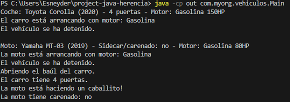

project-java-herencia
Descripción del proyecto

Este proyecto implementa una jerarquía de clases en Java para practicar:

Herencia

Polimorfismo

Generalización

Especialización

Sobrescritura de métodos (@Override)

El dominio seleccionado es el de vehículos y sus componentes.

Jerarquía de clases
Clase base

Vehicle

Atributos comunes: brand, model, year, engine

Métodos:
start(), stop(), getDescription()

Clase soporte

Engine

Atributos: type, horsePower

Clases derivadas

Car extends Vehicle

Atributos: doors

Métodos adicionales: openTrunk()

Sobrescribe: start()

Motorcycle extends Vehicle

Atributos: hasFairing

Métodos adicionales: doWheelie()

Sobrescribe: start()

Diagrama de herencia

             Vehicle
                |
      ---------------------
      |                   |
     Car            Motorcycle

Ejecución del programa

En la clase Main, se crean objetos:

Un Carro

Una Moto

Luego se ejecuta:

Polimorfismo

Métodos sobrescritos

Métodos propios de cada clase

Salida por consola

Autores

Proyecto desarrollado por: Kelin Montoya
